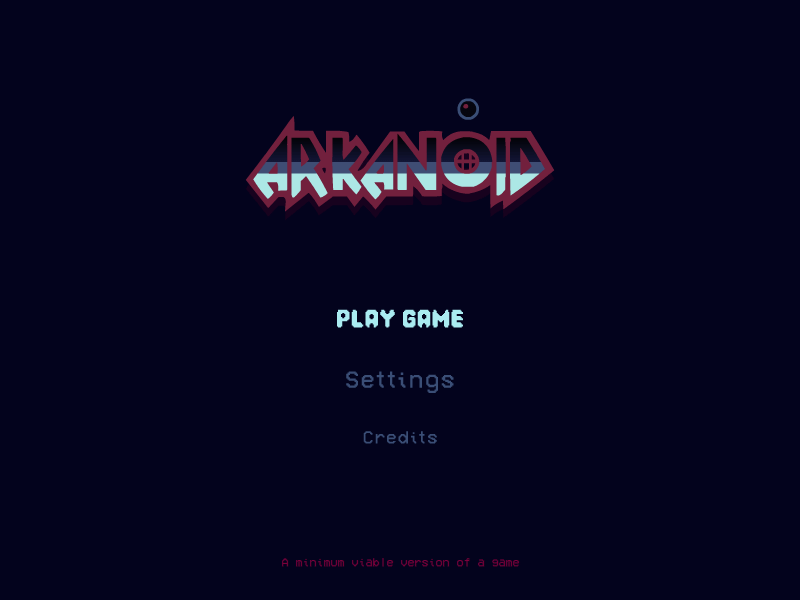

# Arcanoid-POC (Sandbox)
A minimum viable version of a game application with the "Arcanoid" mechanic.

---
> **Legal Notice**: Copyright (c) 2026 Aleksei Gara. All rights reserved.  
> This source code is provided for **review purposes only**. Unauthorized copying, modification, or distribution is strictly prohibited.
---

   <a href="https://alexeygara.github.io/Arcanoid-MVP/">
   

## Licensing Information

### Source Code
The source code of this project is **UNLICENSED**. All rights reserved.
This code is provided for educational and review purposes only. No part of this
source code may be copied, modified, or redistributed without explicit written
permission from the author.

### Assets (Graphics, Fonts)
The visual assets contained in this project (e.g., in the `/public/assets` directory)
are the property of their respective owners and are used here under __*Personal License / Limited Use License*__.

**Note on Assets:** All this visual assets are proprietary and were used with the owner's verbal permission for this technical assessment.

**The author of this repository does not claim ownership of these assets.**
Usage rights for these materials must be obtained from the original creators.

---

## 🚀 Gameplay

Use **_"key A"_** for move left, and **_"key D"_** for move right.